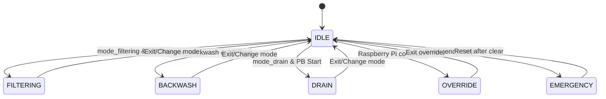
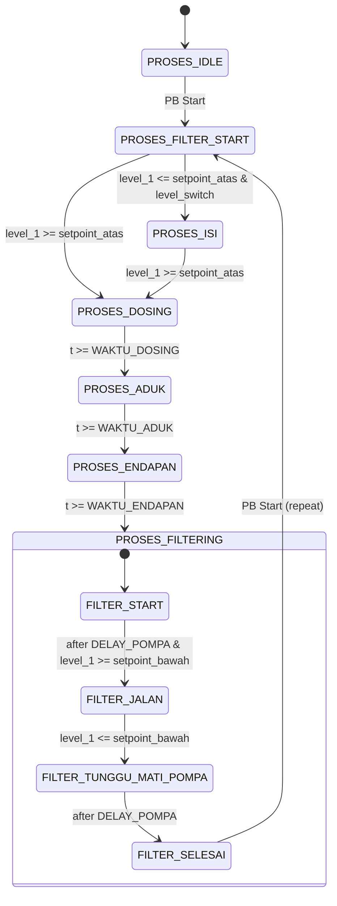
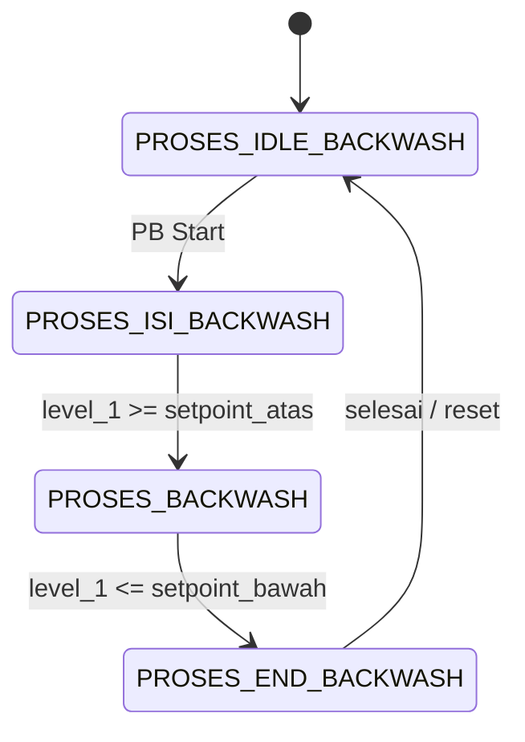
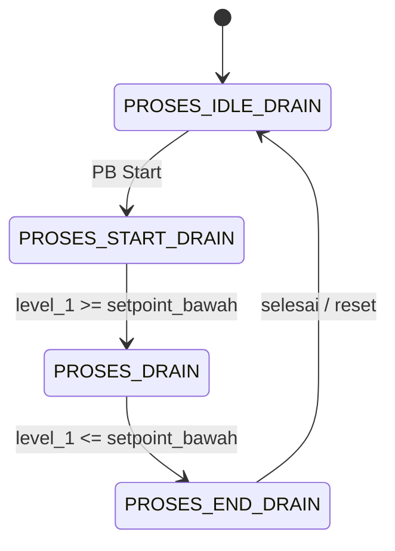

# 💧 Mini WTP Control System – Arduino FSM

> A finite-state-machine (FSM) based controller for a student-scale **Water Treatment Plant**: filtering, backwash, drain, emergency, and Raspberry Pi override.

---

## Table of Contents
- [Overview](#overview)
- [Architecture](#architecture)
- [Key Components](#key-components)
- [Modes (ModeSistem)](#modes-modesistem)
- [Filtering Steps (FilteringStep)](#filtering-steps-filteringstep)
- [Backwash Steps (BackwashStep)](#backwash-steps-backwashstep)
- [Drain Steps (DrainStep)](#drain-steps-drainstep)
- [Flags & One-Shot Logic](#flags--one-shot-logic)
- [I/O Map](#io-map)
- [I2C Transmitters](#i2c-transmitters)
- [Setpoints & Timing](#setpoints--timing)
- [Top-Level Flow](#top-level-flow)
- [Filtering Sub-Flow](#filtering-sub-flow)
- [Raspberry Pi Protocol](#raspberry-pi-protocol)
- [Safety Notes](#safety-notes)
- [Debugging Aids](#debugging-aids)
- [Known Gotchas](#known-gotchas)
- [License](#license)

---

## Overview
This project implements a **robust, non-blocking** control system for a Mini Water Treatment Plant using **Arduino**. It reads process inputs (levels, push buttons, mode switches) and drives actuators (pumps, solenoids, lamps, stepper) through clearly defined **FSM modes** and **process steps**. It also supports a **manual override** channel from a **Raspberry Pi** via UART.

---

## Architecture
- **Main FSM (ModeSistem):** `IDLE`, `FILTERING`, `BACKWASH`, `DRAIN`, `EMERGENCY`, `OVERRIDE`
- **Process FSMs:** per-mode sequencers (Filtering, Backwash, Drain) with timed and conditional transitions
- **I/O Abstraction:** `InputState` and `OutputState` structs
- **Comm Layer:** 10-byte framed packets (start byte + payload + checksum) to/from Raspberry Pi
- **Utilities:** `run_once(flag)` and `blink_led(...)` for one-shot actions and non-blocking timing

---

## Key Components
### InputState & OutputState
**InputState:** Holds sensor readings and button/mode states.  
**OutputState:** Holds actuator and indicator lamp states.

```cpp
struct InputState {
    float level_1, level_2, tds_1, flow_1, pressure_1;
  bool level_switch, pb_start, mode_standby, mode_filtering, mode_backwash, mode_drain, mode_override, emergency_stop;
};

struct OutputState {
    bool solenoid_1, solenoid_2, solenoid_3, solenoid_4, solenoid_5, solenoid_6;
  bool pompa_1, pompa_2, pompa_3;
  bool standby_lamp, filtering_lamp, backwash_lamp, drain_lamp;
  bool stepper;
};
```
---
## Modes (ModeSistem)
| Mode        | Description                                  |
| ----------- | -------------------------------------------- |
| `IDLE`      | Standby mode                                 |
| `FILTERING` | Water filtering process                      |
| `BACKWASH`  | Filter cleaning process                      |
| `OVERRIDE`  | Manual control from Raspberry Pi             |
| `EMERGENCY` | Emergency stop, all outputs off, lamps blink |
| `DRAIN`     | Draining storage tank                        |
---
## Filtering Steps (FilteringStep)
| Step                  | Description               |
| --------------------- | ------------------------- |
| `PROSES_IDLE`         | Waiting for start         |
| `PROSES_FILTER_START` | Initial check and filling |
| `PROSES_ISI`          | Filling tank              |
| `PROSES_DOSING`       | Chemical dosing           |
| `PROSES_ADUK`         | Mixing/agitation          |
| `PROSES_ENDAPAN`      | Sedimentation             |
| `PROSES_FILTERING`    | Filtering process         |
---
## Backwash Steps (BackwashStep)
Structured like filtering with its own preparation, fill, backwash, and close-down phases.

---
## Drain Steps (DrainStep)
Sequencer to safely open valves and empty the storage tank.

---
## Flags & One-Shot Logic

* **Purpose**: Prevent repeated execution of “enter-state” actions in the fast loop().

* **Pattern**: ```if (run_once(FLAG)) { /* do this only once when entering */ }```

* **Main flags**:
    * ```DOSING_FLAG, ADUK_FLAG, ENDAPAN_FLAG``` — one-shot timers for dosing/agitation/sedimentation
    * ```FILTERING_FLAG_CHANGE``` — enter-actions for filtering substeps
    * ```FILTERING_BERULANG_FLAG``` — marks filtering repeat window
    * ```SOLENOID_BACKWASH_FLAG``` — enter-actions for backwash valve logic
    * ```EMERGENGY_LAMP_FLAG``` — initialize emergency blinking pattern
---

## IO Map
#### Digital Inputs
| Signal         | Pin | Notes          |
| -------------- | --- | -------------- |
| Level switch   | 53  | `INPUT_PULLUP` |
| PB Start       | 44  | Active LOW     |
| Mode FILTERING | 52  | Active LOW     |
| Mode BACKWASH  | 50  | Active LOW     |
| Mode DRAIN     | 48  | Active LOW     |
| Emergency Stop | 46  | Active LOW     |

#### Digital Outputs
| Actuator/Lamp                         | Pin            |
| ------------------------------------- | -------------- |
| Solenoid 1..6                         | 9,7,5,3,2,24   |
| Pump 1..3                             | 28,32,36       |
| Lamps (standby/filter/backwash/drain) | -1, 52, 50, 48 |
| Stepper (bool gate)                   | -1             |
---

## I2C Transmitters
| Transmitter          | I2C Address | Comment                          |
| -------------------- | ----------- | -------------------------------- |
| Pressure transmitter | `0x10`      | ASCII float                      |
| Flow transmitter     | `0x11`      | ASCII float                      |
| Level transmitter 1  | `0x12`      | **Make sure different from LT2** |
| Level transmitter 2  | `0x13`      |                                  |
| Quality/TDS          | `0x14`      | ASCII float                      |
---

## Setpoints & Timing
```cpp
SETPOINT_ATAS_TANGKI_AGITATOR = 80;     // %
SETPOINT_BAWAH_TANGKI_AGITATOR = 20;    // %
LEVEL_TANGKI_STORAGE_KOSONG   = 5;      // %

WAKTU_ADUK      = 5000;  // ms (example)
WAKTU_ENDAPAN   = 5000;  // ms
WAKTU_DOSING    = 5000;  // ms
DELAY_POMPA     = 1000;  // ms safety delay
JEDA_FILTERING_BERULANG = 10000; // ms window to repeat
```
**LED blink profiles (non-blocking)**:

* Sedimentation lamp: `ENDAPAN_LED_ON_TIME / ENDAPAN_LED_OFF_TIME`
* Emergency lamps: `EMERGENCY_LED_ON_TIME / EMERGENCY_LED_OFF_TIME`
* Drain lamp: `DRAIN_LED_ON_TIME / DRAIN_LED_OFF_TIME`

---
## Top-Level Flow


---
## Filtering Sub-Flow

---
## Backwash Sub-Flow

---
## Drain Sub-Flow


---
## Raspberry Pi Protocol
Outgoing (Arduino → Pi) and incoming (Pi → Arduino) share a fixed 10-byte frame:
```scss
[0]  START_BYTE (0xAA for TX, 0xBB for RX)  
[1]  level_1 (uint8/float-cast)  
[2]  level_2  
[3]  tds_1  
[4]  flow_1  
[5]  pressure_1  
[6]  input_flags   (bitfield)  
[7]  output_flags  (bitfield: solenoid_1..6, pompa_1..2)  
[8]  output_flags2 (bitfield: pompa_3, lamps, stepper)  
[9]  checksum XOR of [0..8]
```
* **Input flags (byte 6)**:
bit0 level_switch, bit1 pb_start, bit2 mode_standby, bit3 mode_filtering, bit4 mode_backwash, bit5 mode_drain, bit6 mode_override, bit7 emergency_stop

* **Output flags (byte 7)**:
bit0..5 solenoid_1..6, bit6 pompa_1, bit7 pompa_2

* **Output flags2 (byte 8)**:
bit0 pompa_3, bit1 standby_lamp, bit2 filtering_lamp, bit3 backwash_lamp, bit4 drain_lamp, bit5 stepper

---

## Safety Notes
* Emergency instantly forces all actuators OFF and makes lamps blink.
* Pump delays (DELAY_POMPA) and one-shot flags prevent relay chatter.
* Prefer default outputs = OFF during boot (avoid unintended activation).
* Always debounce or design for active-LOW inputs with INPUT_PULLUP.

---
## Debugging Aids
* debug_input() prints inputs, modes, steps, substeps once per second.
* debug_relay() does a relay chaser test at boot (can be disabled if needed).
* Fine-grained state tracing: ModeSistemAktif, LastMode, CurrentMode, StepFilteringAktif, SubFilteringAktif, StepBackwashAktif, StepDrainAktif.
---
## License
kamalogis, made by zelot
